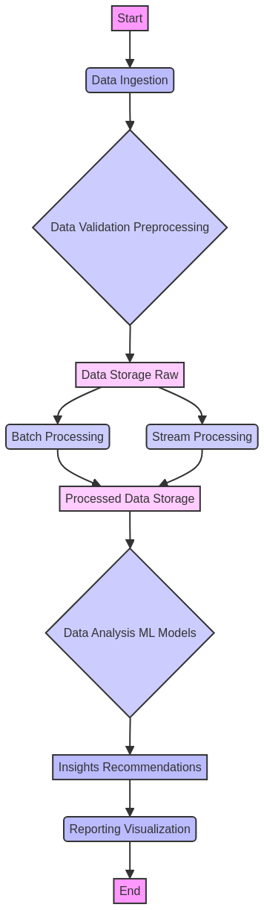

# Big-Data-Processing-Engine

[](https://www.java.com/)
[](https://maven.apache.org/)
[](https://github.com/galafis/Big-Data-Processing-Engine/actions)
[](./src/test/java/com/galafis/bigdataprocessingengine/BigDataProcessingSystemTest.java)
[](LICENSE)

## English

### Overview

This project, **Big-Data-Processing-Engine**, developed by Gabriel Demetrios Lafis, is an enterprise-grade system meticulously engineered for the **efficient processing and insightful analysis of large datasets**. Leveraging modern Java features and robust concurrent programming paradigms, it provides a scalable and maintainable solution for complex big data challenges. The system is designed to ingest, process, analyze, and generate actionable recommendations from vast quantities of data, making it an invaluable asset for data-driven decision-making.

### Features

*   **Data Ingestion**: Robust mechanisms for collecting and storing diverse data records, ensuring data integrity and availability.
*   **Concurrent Processing**: Utilizes `ExecutorService` for parallel and asynchronous data processing, significantly enhancing throughput and reducing latency for large-scale operations.
*   **Advanced Data Analysis**: Performs comprehensive statistical analysis, including calculation of summary statistics (average, minimum, maximum, total records), and identifies critical insights through sophisticated algorithms.
*   **Intelligent Recommendation Engine**: Generates data-driven, actionable recommendations based on the analysis results, aiding in strategic planning and operational optimization.
*   **Modular and Extensible Design**: Built with a clear separation of concerns and adherence to SOLID principles, facilitating easy extension, maintenance, and integration with other systems.
*   **Comprehensive Logging**: Integrated with SLF4J and Logback for detailed and configurable logging, crucial for monitoring, debugging, and auditing system operations.

### Architecture

The system employs a **modular and layered architecture** to ensure scalability, maintainability, and clear separation of concerns. Key components include:

*   **Core Processing Unit**: Handles the primary logic for data manipulation and analysis.
*   **Data Management Layer**: Manages data records, including storage and retrieval.
*   **Concurrency Layer**: Orchestrates parallel execution of tasks using Java's `ExecutorService`.
*   **Configuration Management**: Externalized configuration for flexible deployment and environment adaptation.


### Workflow

The data processing workflow is designed for efficiency and clarity, encompassing several critical stages from raw data ingestion to the delivery of actionable intelligence:

1.  **Initialization**: The system starts, loading configurations and preparing resources.
2.  **Data Generation/Ingestion**: Sample data is generated, or external data is ingested into the system.
3.  **Concurrent Processing**: Data records are processed in parallel to calculate summary statistics, generate insights, and formulate recommendations.
4.  **Analysis Result Generation**: A comprehensive `AnalysisResult` object is created, encapsulating all findings.
5.  **Reporting/Export**: Results are logged to the console and can be exported for further use.
6.  **Graceful Shutdown**: System resources are released, and the `ExecutorService` is terminated.



### Project Structure

The repository is organized to reflect a standard Maven project structure, promoting clarity and ease of navigation:

```
Big-Data-Processing-Engine/
├── .github/                  # GitHub specific configurations (e.g., workflows)
├── config/                   # Application configuration files
│   └── application.properties
├── docs/                     # Documentation and assets
│   ├── diagrams/             # Architecture and workflow diagrams
│   │   ├── architecture.md
│   │   ├── architecture.png
│   │   ├── workflow.mmd
│   │   └── workflow.png
│   └── hero_image.png        # Hero image for the README
├── src/
│   ├── main/
│   │   └── java/             # Main Java source code
│   │       └── com/galafis/bigdataprocessingengine/
│   │           ├── BigDataProcessingSystem.java
│   │           ├── DataRecord.java
│   │           ├── AnalysisResult.java
│   │           ├── IDataProcessor.java
│   │           └── DefaultDataProcessor.java
│   └── test/
│       └── java/             # Test Java source code
│           └── com/galafis/bigdataprocessingengine/
│               └── BigDataProcessingSystemTest.java
├── target/                   # Compiled classes and JARs (generated by Maven)
├── pom.xml                   # Maven Project Object Model file
├── README.md                 # This README file
├── LICENSE                   # Project license file
└── CONTRIBUTING.md           # Guidelines for contributing
```

### Getting Started

To get a local copy of the project up and running, follow these simple steps.

#### Prerequisites

*   Java Development Kit (JDK) 17 or higher
*   Apache Maven 3.8.6 or higher

#### Installation

1.  **Clone the repository:**

    ```bash
    git clone https://github.com/galafis/Big-Data-Processing-Engine.git
    cd Big-Data-Processing-Engine
    ```

2.  **Build the project:**

    ```bash
    mvn clean install
    ```

#### Usage

To run the system and observe its functionality, execute the main class from the project root:

```bash
java -jar target/big-data-processing-engine-1.0.0-jar-with-dependencies.jar
```

This command will initialize the system with sample data, process it, and print the detailed analysis results, insights, and recommendations to the console.

### Contributing

Contributions are what make the open-source community such an amazing place to learn, inspire, and create. Any contributions you make are **greatly appreciated**.

1.  Fork the Project
2.  Create your Feature Branch (`git checkout -b feature/AmazingFeature`)
3.  Commit your Changes (`git commit -m 'Add some AmazingFeature'`)
4.  Push to the Branch (`git push origin feature/AmazingFeature`)
5.  Open a Pull Request

### License

Distributed under the MIT License. See `LICENSE` for more information.

### Contact

Gabriel Demetrios Lafis - [Your Email/LinkedIn/GitHub Profile]

Project Link: [https://github.com/galafis/Big-Data-Processing-Engine](https://github.com/galafis/Big-Data-Processing-Engine)

---

## Português

### Visão Geral

Este projeto, **Big-Data-Processing-Engine**, desenvolvido por Gabriel Demetrios Lafis, é um sistema de nível empresarial meticulosamente projetado para o **processamento eficiente e análise perspicaz de grandes conjuntos de dados**. Aproveitando os recursos modernos do Java e paradigmas robustos de programação concorrente, ele oferece uma solução escalável e de fácil manutenção para desafios complexos de big data. O sistema é projetado para ingerir, processar, analisar e gerar recomendações acionáveis a partir de vastas quantidades de dados, tornando-o um ativo inestimável para a tomada de decisões baseada em dados.

### Funcionalidades

*   **Ingestão de Dados**: Mecanismos robustos para coleta e armazenamento de diversos registros de dados, garantindo a integridade e disponibilidade dos dados.
*   **Processamento Concorrente**: Utiliza `ExecutorService` para processamento de dados paralelo e assíncrono, aumentando significativamente o rendimento e reduzindo a latência para operações em larga escala.
*   **Análise de Dados Avançada**: Realiza análises estatísticas abrangentes, incluindo o cálculo de estatísticas de resumo (média, mínimo, máximo, total de registros) e identifica insights críticos por meio de algoritmos sofisticados.
*   **Mecanismo de Recomendação Inteligente**: Gera recomendações acionáveis e baseadas em dados a partir dos resultados da análise, auxiliando no planejamento estratégico e na otimização operacional.
*   **Design Modular e Extensível**: Construído com uma clara separação de preocupações e aderência aos princípios SOLID, facilitando a extensão, manutenção e integração com outros sistemas.
*   **Registro Abrangente (Logging)**: Integrado com SLF4J e Logback para registro detalhado e configurável, crucial para monitoramento, depuração e auditoria das operações do sistema.

### Arquitetura

O sistema emprega uma **arquitetura modular e em camadas** para garantir escalabilidade, manutenibilidade e clara separação de preocupações. Os principais componentes incluem:

*   **Unidade de Processamento Central**: Lida com a lógica primária para manipulação e análise de dados.
*   **Camada de Gerenciamento de Dados**: Gerencia os registros de dados, incluindo armazenamento e recuperação.
*   **Camada de Concorrência**: Orquestra a execução paralela de tarefas usando o `ExecutorService` do Java.
*   **Gerenciamento de Configuração**: Configuração externalizada para implantação flexível e adaptação ao ambiente.


### Fluxo de Trabalho

O fluxo de trabalho de processamento de dados é projetado para eficiência e clareza, abrangendo várias etapas críticas, desde a ingestão de dados brutos até a entrega de inteligência acionável:

1.  **Inicialização**: O sistema inicia, carregando configurações e preparando recursos.
2.  **Geração/Ingestão de Dados**: Dados de exemplo são gerados, ou dados externos são ingeridos no sistema.
3.  **Processamento Concorrente**: Os registros de dados são processados em paralelo para calcular estatísticas de resumo, gerar insights e formular recomendações.
4.  **Geração de Resultados de Análise**: Um objeto `AnalysisResult` abrangente é criado, encapsulando todas as descobertas.
5.  **Relatório/Exportação**: Os resultados são registrados no console e podem ser exportados para uso posterior.
6.  **Desligamento Gracioso**: Os recursos do sistema são liberados e o `ExecutorService` é encerrado.


### Estrutura do Projeto

O repositório é organizado para refletir uma estrutura de projeto Maven padrão, promovendo clareza e facilidade de navegação:

```
Big-Data-Processing-Engine/
├── .github/                  # Configurações específicas do GitHub (ex: workflows)
├── config/                   # Arquivos de configuração da aplicação
│   └── application.properties
├── docs/                     # Documentação e ativos
│   ├── diagrams/             # Diagramas de arquitetura e fluxo de trabalho
│   │   ├── architecture.md
│   │   ├── architecture.png
│   │   ├── workflow.mmd
│   │   └── workflow.png
│   └── hero_image.png        # Imagem hero para o README
├── src/
│   ├── main/
│   │   └── java/             # Código fonte Java principal
│   │       └── com/galafis/bigdataprocessingengine/
│   │           ├── BigDataProcessingSystem.java
│   │           ├── DataRecord.java
│   │           ├── AnalysisResult.java
│   │           ├── IDataProcessor.java
│   │           └── DefaultDataProcessor.java
│   └── test/
│       └── java/             # Código fonte Java de teste
│           └── com/galafis/bigdataprocessingengine/
│               └── BigDataProcessingSystemTest.java
├── target/                   # Classes compiladas e JARs (gerados pelo Maven)
├── pom.xml                   # Arquivo Project Object Model do Maven
├── README.md                 # Este arquivo README
├── LICENSE                   # Arquivo de licença do projeto
└── CONTRIBUTING.md           # Diretrizes para contribuição
```

### Primeiros Passos

Para ter uma cópia local do projeto funcionando, siga estes passos simples.

#### Pré-requisitos

*   Java Development Kit (JDK) 17 ou superior
*   Apache Maven 3.8.6 ou superior

#### Instalação

1.  **Clone o repositório:**

    ```bash
    git clone https://github.com/galafis/Big-Data-Processing-Engine.git
    cd Big-Data-Processing-Engine
    ```

2.  **Construa o projeto:**

    ```bash
    mvn clean install
    ```

#### Uso

Para executar o sistema e observar sua funcionalidade, execute a classe principal a partir da raiz do projeto:

```bash
java -jar target/big-data-processing-engine-1.0.0-jar-with-dependencies.jar
```

Este comando inicializará o sistema com dados de exemplo, os processará e imprimirá os resultados detalhados da análise, insights e recomendações no console.

### Como Contribuir

Contribuições são o que tornam a comunidade open-source um lugar incrível para aprender, inspirar e criar. Quaisquer contribuições que você fizer são **muito apreciadas**.

1.  Faça um Fork do Projeto
2.  Crie sua Feature Branch (`git checkout -b feature/AmazingFeature`)
3.  Faça Commit de suas Alterações (`git commit -m 'Add some AmazingFeature'`)
4.  Envie para a Branch (`git push origin feature/AmazingFeature`)
5.  Abra um Pull Request

### Licença

Distribuído sob a Licença MIT. Veja `LICENSE` para mais informações.

### Contato

Gabriel Demetrios Lafis - [Seu Email/LinkedIn/Perfil GitHub]

Link do Projeto: [https://github.com/galafis/Big-Data-Processing-Engine](https://github.com/galafis/Big-Data-Processing-Engine)

