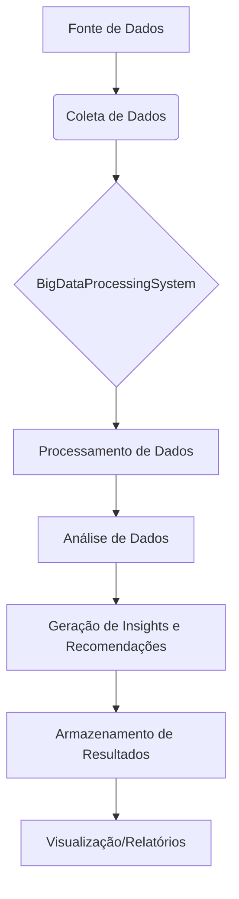

```mermaid
graph TD
    A[Fonte de Dados] --> B(Coleta de Dados)
    B --> C{BigDataProcessingSystem}
    C --> D[Processamento de Dados]
    D --> E[Análise de Dados]
    E --> F[Geração de Insights e Recomendações]
    F --> G[Armazenamento de Resultados]
    G --> H[Visualização/Relatórios]
```
